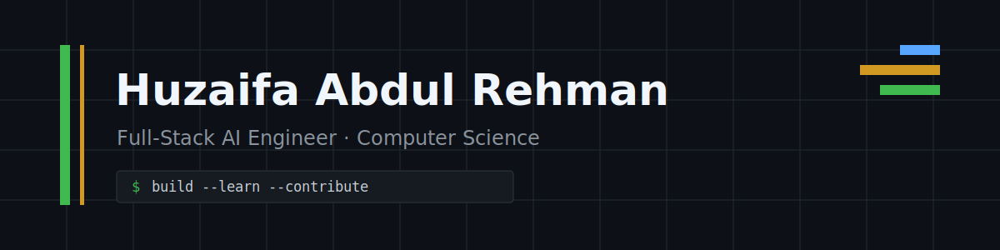

  

  
  
  
  

## About

I am a **Full-Stack AI Engineer** and BS Computer Science student at FAST NUCES, Karachi. I build end-to-end products that combine modern web applications with practical machine-learning systems. My work spans React and Next.js, Python ML pipelines, computer vision, graph algorithms, and information retrieval.

I care about turning ideas into documented, runnable software: defining the problem clearly, choosing practical tools, measuring results, and improving the implementation through testing and review.

## Selected work

<table>
  <tr>
    <td width="50%" valign="top">
      <h3><a href="https://github.com/HuzaifaAbdulRehman/driver-drowsiness-detection">Driver Drowsiness Detection</a></h3>
      
Real-time safety system combining a fine-tuned MobileNetV2 eye-state classifier with MediaPipe facial landmarks. The project evaluation reports <strong>97.30% accuracy</strong> on the MRL Eye dataset.

      
<code>Python</code> <code>TensorFlow</code> <code>MediaPipe</code> <code>OpenCV</code> <code>Streamlit</code>

    </td>
    <td width="50%" valign="top">
      <h3><a href="https://github.com/HuzaifaAbdulRehman/Electrolux-EMS">Electrolux EMS</a></h3>
      
Electricity distribution management system for customer billing, power usage, and service requests, with typed validation and database-backed authentication.

      
<code>Next.js</code> <code>TypeScript</code> <code>MySQL</code> <code>Drizzle ORM</code> <code>NextAuth</code>

    </td>
  </tr>
  <tr>
    <td width="50%" valign="top">
      <h3><a href="https://github.com/HuzaifaAbdulRehman/fast-academic-hub">FAST Academic Hub</a></h3>
      
Offline-first attendance planner that calculates course attendance in real time and helps students model planned absences. Built as an installable responsive PWA.

      
<a href="https://github.com/HuzaifaAbdulRehman/fast-academic-hub"><strong>View source</strong></a>

      
<code>React</code> <code>Vite</code> <code>Tailwind CSS</code> <code>PWA</code>

    </td>
    <td width="50%" valign="top">
      <h3><a href="https://github.com/HuzaifaAbdulRehman/dijkstra-ml-routing-optimization">Dijkstra + ML Routing</a></h3>
      
Route-planning experiment combining a custom Dijkstra implementation with engineered road features and gradient boosting on OpenStreetMap networks.

      
<code>Python</code> <code>NetworkX</code> <code>OSMnx</code> <code>scikit-learn</code> <code>XGBoost</code>

    </td>
  </tr>
</table>

## Open source

I am currently working on a contribution to [Oppia](https://github.com/oppia/oppia), an open-source learning platform, migrating a community-library acceptance test from Puppeteer to Playwright.

- [Implementation and validation evidence](https://github.com/oppia/oppia/issues/26819#issuecomment-5043100774)
- [Stress test: 203/203 jobs passed](https://github.com/HuzaifaAbdulRehman/oppia/actions/runs/29896087005)

## Toolbox

  
  
  
  
  
  
  
  
  
  
  

## Current focus

- Improving production frontend engineering with React, Next.js, and TypeScript.
- Building measurable applied-AI projects rather than notebook-only demos.
- Learning established open-source workflows through real reviews and test infrastructure.

## Activity

<picture>
  <source media="(prefers-color-scheme: dark)" srcset="https://github-readme-activity-graph.vercel.app/graph?username=HuzaifaAbdulRehman&amp;theme=github-compact&amp;hide_border=true&amp;area=true" />
  <source media="(prefers-color-scheme: light)" srcset="https://github-readme-activity-graph.vercel.app/graph?username=HuzaifaAbdulRehman&amp;theme=minimal&amp;hide_border=true&amp;area=true" />
  
</picture>

---

  <strong>Interested in full-stack engineering, applied AI, and open-source collaboration.</strong> 
  <a href="https://github.com/HuzaifaAbdulRehman?tab=repositories">Explore my repositories</a> ·
  <a href="https://www.linkedin.com/in/huzaifa-abdul-rehman-701732289/">Connect on LinkedIn</a>

