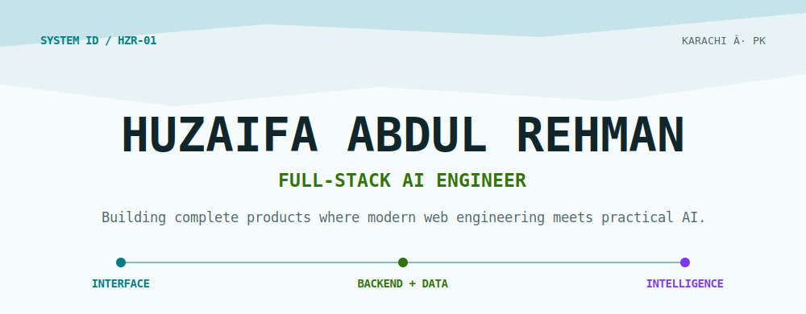
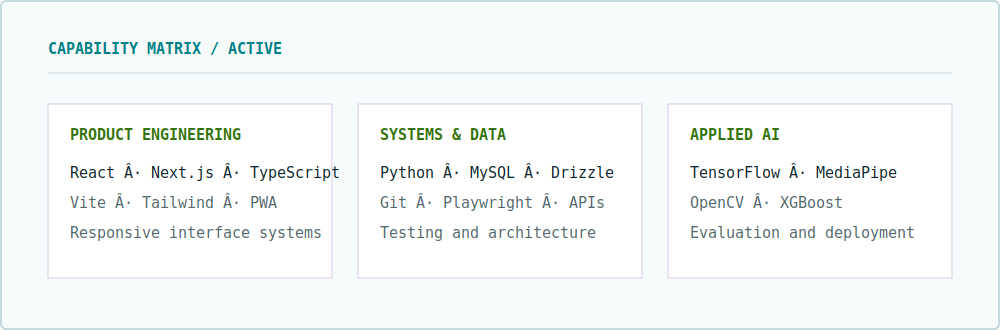
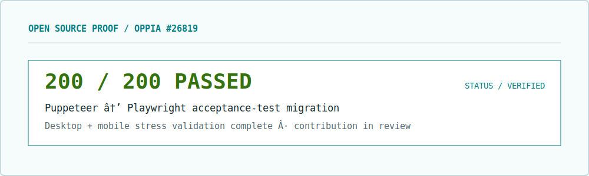

<picture>
  <source media="(prefers-color-scheme: dark)" srcset="assets/console-header-dark.svg" />
  <source media="(prefers-color-scheme: light)" srcset="assets/console-header-light.svg" />
  
</picture>

  
  
  
  

## About Me

> ### Building complete products at the intersection of modern web engineering and practical AI.

I am a BS Computer Science student at **FAST NUCES, Karachi**, taking ideas from interface to implementation. I build responsive full-stack applications and measurable machine-learning systems with an emphasis on reliable testing.

**Now:** contributing a tested Playwright migration to Oppia and exploring internship and junior engineering opportunities.

## Technologies

<strong>Web and product engineering</strong>

  

<strong>AI, data, and engineering</strong>

  

<em>Also worked with Drizzle ORM, MediaPipe, XGBoost, Streamlit, NetworkX, OSMnx, C, and C++.</em>

<picture>
  <source media="(prefers-color-scheme: dark)" srcset="assets/console-capabilities-dark.svg" />
  <source media="(prefers-color-scheme: light)" srcset="assets/console-capabilities-light.svg" />
  
</picture>

## Selected Projects

<table>
  <tr>
    <td width="50%" valign="top">
      <h3><a href="https://github.com/HuzaifaAbdulRehman/driver-drowsiness-detection">Driver Drowsiness Detection</a></h3>
      
Real-time safety system combining a fine-tuned <strong>MobileNetV2</strong> eye-state classifier with MediaPipe facial landmarks. Achieved <strong>97.30% reported accuracy</strong> on the MRL Eye dataset.

      
<code>Python</code> <code>TensorFlow</code> <code>MediaPipe</code> <code>OpenCV</code>

    </td>
    <td width="50%" valign="top">
      <h3><a href="https://github.com/HuzaifaAbdulRehman/Electrolux-EMS">Electrolux EMS</a></h3>
      
Electricity distribution management for customer billing, power usage, authentication, and service requests.

      
<code>Next.js</code> <code>TypeScript</code> <code>MySQL</code> <code>Drizzle ORM</code>

    </td>
  </tr>
  <tr>
    <td width="50%" valign="top">
      <h3><a href="https://github.com/HuzaifaAbdulRehman/fast-academic-hub">FAST Academic Hub</a></h3>
      
Offline-first attendance planner that calculates attendance in real time and models planned absences as an installable responsive PWA.

      
<code>React</code> <code>Vite</code> <code>Tailwind CSS</code> <code>PWA</code>

    </td>
    <td width="50%" valign="top">
      <h3><a href="https://github.com/HuzaifaAbdulRehman/dijkstra-ml-routing-optimization">Dijkstra + ML Routing</a></h3>
      
Route planning that combines graph search with engineered road features and XGBoost on real OpenStreetMap networks.

      
<code>Python</code> <code>NetworkX</code> <code>OSMnx</code> <code>XGBoost</code>

    </td>
  </tr>
</table>

## Open Source

I migrated an **Oppia** community-library acceptance test from Puppeteer to Playwright. The contribution is currently awaiting maintainer review.

<picture>
  <source media="(prefers-color-scheme: dark)" srcset="assets/console-proof-dark.svg" />
  <source media="(prefers-color-scheme: light)" srcset="assets/console-proof-light.svg" />
  
</picture>

- [Implementation and validation evidence](https://github.com/oppia/oppia/issues/26819#issuecomment-5043100774)
- [Stress test: 200/200 desktop and mobile runs passed](https://github.com/HuzaifaAbdulRehman/oppia/actions/runs/29896087005) (203 workflow jobs total)

## GitHub Activity

  <picture>
    <source media="(prefers-color-scheme: dark)" srcset="https://github-readme-stats-sigma-five.vercel.app/api?username=HuzaifaAbdulRehman&amp;show_icons=true&amp;hide_border=true&amp;bg_color=071014&amp;title_color=22D3EE&amp;icon_color=A3E635&amp;text_color=F8FAFC&amp;include_all_commits=true&amp;rank_icon=github" />
    <source media="(prefers-color-scheme: light)" srcset="https://github-readme-stats-sigma-five.vercel.app/api?username=HuzaifaAbdulRehman&amp;show_icons=true&amp;hide_border=true&amp;bg_color=F6FBFC&amp;title_color=007C83&amp;icon_color=34720D&amp;text_color=11262B&amp;include_all_commits=true&amp;rank_icon=github" />
    
  </picture>
  <picture>
    <source media="(prefers-color-scheme: dark)" srcset="https://github-readme-stats-sigma-five.vercel.app/api/top-langs/?username=HuzaifaAbdulRehman&amp;layout=compact&amp;hide_border=true&amp;bg_color=071014&amp;title_color=22D3EE&amp;text_color=F8FAFC&amp;langs_count=8" />
    <source media="(prefers-color-scheme: light)" srcset="https://github-readme-stats-sigma-five.vercel.app/api/top-langs/?username=HuzaifaAbdulRehman&amp;layout=compact&amp;hide_border=true&amp;bg_color=F6FBFC&amp;title_color=007C83&amp;text_color=11262B&amp;langs_count=8" />
    
  </picture>

<picture>
  <source media="(prefers-color-scheme: dark)" srcset="https://raw.githubusercontent.com/HuzaifaAbdulRehman/HuzaifaAbdulRehman/output/github-contribution-grid-snake-dark.svg" />
  <source media="(prefers-color-scheme: light)" srcset="https://raw.githubusercontent.com/HuzaifaAbdulRehman/HuzaifaAbdulRehman/output/github-contribution-grid-snake.svg" />
  
</picture>

---

  <strong>Open to internships, junior engineering roles, and applied-AI collaborations.</strong>  
  <a href="https://github.com/HuzaifaAbdulRehman?tab=repositories">Explore my repositories</a> &nbsp;·&nbsp;
  <a href="https://www.linkedin.com/in/huzaifa-abdul-rehman-701732289/">Connect on LinkedIn</a>

