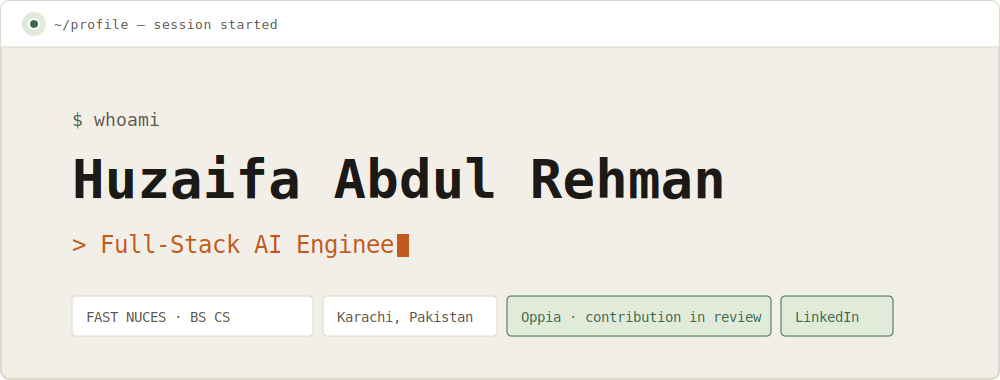
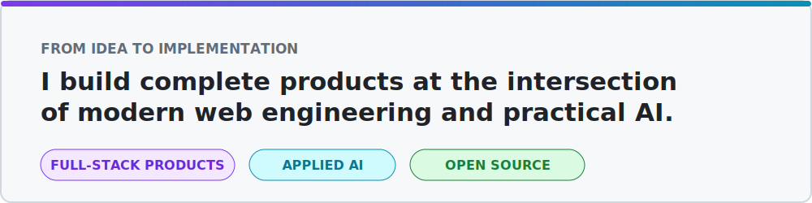
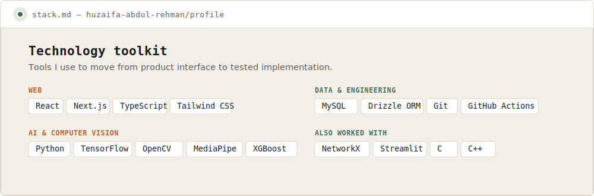
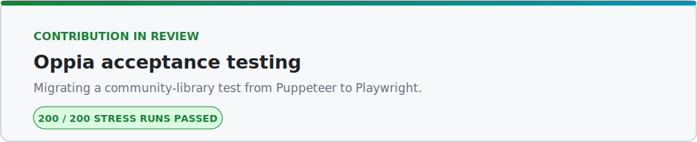
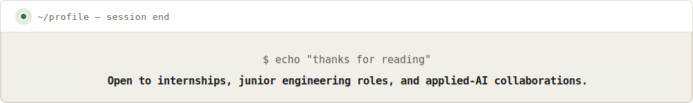

<!-- ═══════════════════════ HEADER ═══════════════════════ -->

<picture>
  <source media="(prefers-color-scheme: dark)" srcset="assets/header-dark.svg" />
  <source media="(prefers-color-scheme: light)" srcset="assets/header-light.svg" />
  
</picture>

  <a href="https://www.nu.edu.pk/">FAST NUCES</a> &nbsp;·&nbsp; <a href="https://github.com/oppia/oppia/issues/26819">Oppia contribution</a> &nbsp;·&nbsp; <a href="https://www.linkedin.com/in/huzaifa-abdul-rehman-701732289/">LinkedIn</a>

<!-- ═══════════════════════ ABOUT ═══════════════════════ -->

## About Me

<picture>
  <source media="(prefers-color-scheme: dark)" srcset="assets/about-dark.svg" />
  <source media="(prefers-color-scheme: light)" srcset="assets/about-light.svg" />
  
</picture>

I am a BS Computer Science student at **FAST NUCES, Karachi**, taking ideas from interface to implementation. I build responsive applications and practical machine-learning systems with an emphasis on measurable results and reliable testing.

**Now:** contributing a tested Playwright migration to Oppia and exploring internship and junior engineering opportunities.

<!-- ═══════════════════════ TECH STACK ═══════════════════════ -->

## Technologies

<picture>
  <source media="(prefers-color-scheme: dark)" srcset="assets/technologies-dark.svg" />
  <source media="(prefers-color-scheme: light)" srcset="assets/technologies-light.svg" />
  
</picture>

<!-- ═══════════════════════ FEATURED PROJECTS ═══════════════════════ -->

## Selected Projects

<table>
  <tr>
    <td width="50%" valign="top">
      <h3><a href="https://github.com/HuzaifaAbdulRehman/driver-drowsiness-detection">Driver Drowsiness Detection</a></h3>
      
Real-time safety system combining a fine-tuned <strong>MobileNetV2</strong> eye-state classifier with MediaPipe facial landmarks — <strong>97.30% accuracy</strong> on the MRL Eye dataset.

      
<code>Python</code> <code>TensorFlow</code> <code>MediaPipe</code> <code>OpenCV</code>

    </td>
    <td width="50%" valign="top">
      <h3><a href="https://github.com/HuzaifaAbdulRehman/Electrolux-EMS">Electrolux EMS</a></h3>
      
Electricity distribution management system for customer billing, power usage, and service requests — typed validation and database-backed authentication end to end.

      
<code>Next.js</code> <code>TypeScript</code> <code>MySQL</code> <code>Drizzle ORM</code>

    </td>
  </tr>
  <tr>
    <td width="50%" valign="top">
      <h3><a href="https://github.com/HuzaifaAbdulRehman/fast-academic-hub">FAST Academic Hub</a></h3>
      
Offline-first attendance planner that calculates course attendance in real time and models planned absences. Installable, responsive <strong>PWA</strong>.

      
<code>React</code> <code>Vite</code> <code>Tailwind CSS</code> <code>PWA</code>

    </td>
    <td width="50%" valign="top">
      <h3><a href="https://github.com/HuzaifaAbdulRehman/dijkstra-ml-routing-optimization">Dijkstra + ML Routing</a></h3>
      
Route planning that fuses a custom <strong>Dijkstra</strong> implementation with engineered road features and <strong>XGBoost</strong> on real OpenStreetMap networks.

      
<code>Python</code> <code>NetworkX</code> <code>OSMnx</code> <code>XGBoost</code>

    </td>
  </tr>
</table>

<!-- ═══════════════════════ OPEN SOURCE ═══════════════════════ -->

## Open Source

<picture>
  <source media="(prefers-color-scheme: dark)" srcset="assets/open-source-dark.svg" />
  <source media="(prefers-color-scheme: light)" srcset="assets/open-source-light.svg" />
  
</picture>

- [Implementation and validation evidence](https://github.com/oppia/oppia/issues/26819#issuecomment-5043100774)
- [Stress test: 200/200 desktop and mobile runs passed](https://github.com/HuzaifaAbdulRehman/oppia/actions/runs/29896087005) (203 workflow jobs total)

<!-- ═══════════════════════ GITHUB ANALYTICS ═══════════════════════ -->

## GitHub Activity

  <picture>
    <source media="(prefers-color-scheme: dark)" srcset="https://github-readme-stats-sigma-five.vercel.app/api?username=HuzaifaAbdulRehman&amp;show_icons=true&amp;hide_border=true&amp;bg_color=0B0D10&amp;title_color=FF8A3D&amp;icon_color=6FCF9E&amp;text_color=E8E6E1&amp;include_all_commits=true&amp;rank_icon=github" />
    <source media="(prefers-color-scheme: light)" srcset="https://github-readme-stats-sigma-five.vercel.app/api?username=HuzaifaAbdulRehman&amp;show_icons=true&amp;hide_border=true&amp;bg_color=F2EFE9&amp;title_color=C25A1E&amp;icon_color=3D6B52&amp;text_color=1B1A17&amp;include_all_commits=true&amp;rank_icon=github" />
    
  </picture>
  <picture>
    <source media="(prefers-color-scheme: dark)" srcset="https://github-readme-stats-sigma-five.vercel.app/api/top-langs/?username=HuzaifaAbdulRehman&amp;layout=compact&amp;hide_border=true&amp;bg_color=0B0D10&amp;title_color=FF8A3D&amp;text_color=E8E6E1&amp;langs_count=8" />
    <source media="(prefers-color-scheme: light)" srcset="https://github-readme-stats-sigma-five.vercel.app/api/top-langs/?username=HuzaifaAbdulRehman&amp;layout=compact&amp;hide_border=true&amp;bg_color=F2EFE9&amp;title_color=C25A1E&amp;text_color=1B1A17&amp;langs_count=8" />
    
  </picture>

<!-- ═══════════════════════ CONTRIBUTION SNAKE ═══════════════════════ -->

<picture>
  <source media="(prefers-color-scheme: dark)" srcset="https://raw.githubusercontent.com/HuzaifaAbdulRehman/HuzaifaAbdulRehman/output/github-contribution-grid-snake-dark.svg" />
  <source media="(prefers-color-scheme: light)" srcset="https://raw.githubusercontent.com/HuzaifaAbdulRehman/HuzaifaAbdulRehman/output/github-contribution-grid-snake.svg" />
  
</picture>

<!-- ═══════════════════════ FOOTER ═══════════════════════ -->

<picture>
  <source media="(prefers-color-scheme: dark)" srcset="assets/footer-dark.svg" />
  <source media="(prefers-color-scheme: light)" srcset="assets/footer-light.svg" />
  
</picture>

  <a href="https://github.com/HuzaifaAbdulRehman?tab=repositories">Explore my repositories</a> ·
  <a href="https://www.linkedin.com/in/huzaifa-abdul-rehman-701732289/">Connect on LinkedIn</a>

