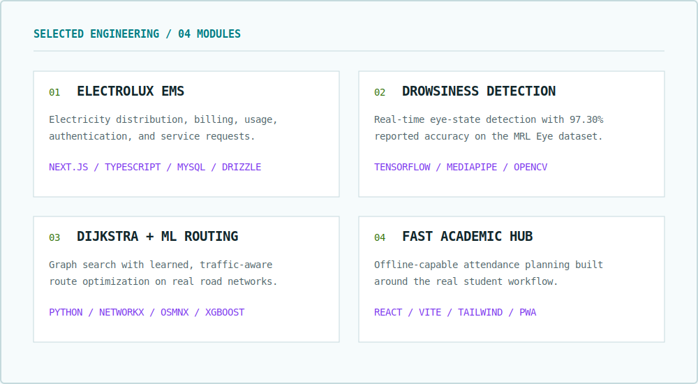

<picture>
  <source media="(prefers-color-scheme: dark)" srcset="assets/console-header-dark.svg" />
  <source media="(prefers-color-scheme: light)" srcset="assets/console-header-light.svg" />
  
</picture>

  <a href="https://www.nu.edu.pk/">FAST NUCES</a> &nbsp;·&nbsp;
  <a href="https://github.com/oppia/oppia/issues/26819">Open source</a> &nbsp;·&nbsp;
  <a href="https://www.linkedin.com/in/huzaifa-abdul-rehman-701732289/">LinkedIn</a>

I am a BS Computer Science student at **FAST NUCES, Karachi**. I take products from interface to implementation, combining responsive full-stack applications with practical machine-learning systems that can be tested, measured, and improved.

> **Current focus:** a tested Playwright migration for Oppia, alongside internship and junior engineering opportunities.

## Capability Matrix

<picture>
  <source media="(prefers-color-scheme: dark)" srcset="assets/console-capabilities-dark.svg" />
  <source media="(prefers-color-scheme: light)" srcset="assets/console-capabilities-light.svg" />
  
</picture>

## Selected Engineering

<picture>
  <source media="(prefers-color-scheme: dark)" srcset="assets/console-projects-dark.svg" />
  <source media="(prefers-color-scheme: light)" srcset="assets/console-projects-light.svg" />
  
</picture>

| Project | Engineering focus |
|---|---|
| [Electrolux EMS](https://github.com/HuzaifaAbdulRehman/Electrolux-EMS) | Next.js, TypeScript, MySQL, Drizzle ORM |
| [Driver Drowsiness Detection](https://github.com/HuzaifaAbdulRehman/driver-drowsiness-detection) | TensorFlow, MediaPipe, OpenCV |
| [Dijkstra + ML Routing](https://github.com/HuzaifaAbdulRehman/dijkstra-ml-routing-optimization) | Python, NetworkX, OSMnx, XGBoost |
| [FAST Academic Hub](https://github.com/HuzaifaAbdulRehman/fast-academic-hub) | React, Vite, Tailwind CSS, PWA |

## Open Source Proof

<picture>
  <source media="(prefers-color-scheme: dark)" srcset="assets/console-proof-dark.svg" />
  <source media="(prefers-color-scheme: light)" srcset="assets/console-proof-light.svg" />
  
</picture>

- [Implementation and validation evidence](https://github.com/oppia/oppia/issues/26819#issuecomment-5043100774)
- [Stress test: 200/200 desktop and mobile runs passed](https://github.com/HuzaifaAbdulRehman/oppia/actions/runs/29896087005) (203 workflow jobs total)

## GitHub Activity

  <picture>
    <source media="(prefers-color-scheme: dark)" srcset="https://github-readme-stats-sigma-five.vercel.app/api?username=HuzaifaAbdulRehman&amp;show_icons=true&amp;hide_border=true&amp;bg_color=071014&amp;title_color=22D3EE&amp;icon_color=A3E635&amp;text_color=F8FAFC&amp;include_all_commits=true&amp;rank_icon=github" />
    <source media="(prefers-color-scheme: light)" srcset="https://github-readme-stats-sigma-five.vercel.app/api?username=HuzaifaAbdulRehman&amp;show_icons=true&amp;hide_border=true&amp;bg_color=F6FBFC&amp;title_color=007C83&amp;icon_color=34720D&amp;text_color=11262B&amp;include_all_commits=true&amp;rank_icon=github" />
    
  </picture>
  <picture>
    <source media="(prefers-color-scheme: dark)" srcset="https://github-readme-stats-sigma-five.vercel.app/api/top-langs/?username=HuzaifaAbdulRehman&amp;layout=compact&amp;hide_border=true&amp;bg_color=071014&amp;title_color=22D3EE&amp;text_color=F8FAFC&amp;langs_count=8" />
    <source media="(prefers-color-scheme: light)" srcset="https://github-readme-stats-sigma-five.vercel.app/api/top-langs/?username=HuzaifaAbdulRehman&amp;layout=compact&amp;hide_border=true&amp;bg_color=F6FBFC&amp;title_color=007C83&amp;text_color=11262B&amp;langs_count=8" />
    
  </picture>

<picture>
  <source media="(prefers-color-scheme: dark)" srcset="https://raw.githubusercontent.com/HuzaifaAbdulRehman/HuzaifaAbdulRehman/output/github-contribution-grid-snake-dark.svg" />
  <source media="(prefers-color-scheme: light)" srcset="https://raw.githubusercontent.com/HuzaifaAbdulRehman/HuzaifaAbdulRehman/output/github-contribution-grid-snake.svg" />
  
</picture>

---

  <strong>Open to internships, junior engineering roles, and applied-AI collaborations.</strong>  
  <a href="https://github.com/HuzaifaAbdulRehman?tab=repositories">Explore repositories</a> &nbsp;·&nbsp;
  <a href="https://www.linkedin.com/in/huzaifa-abdul-rehman-701732289/">Connect on LinkedIn</a>

